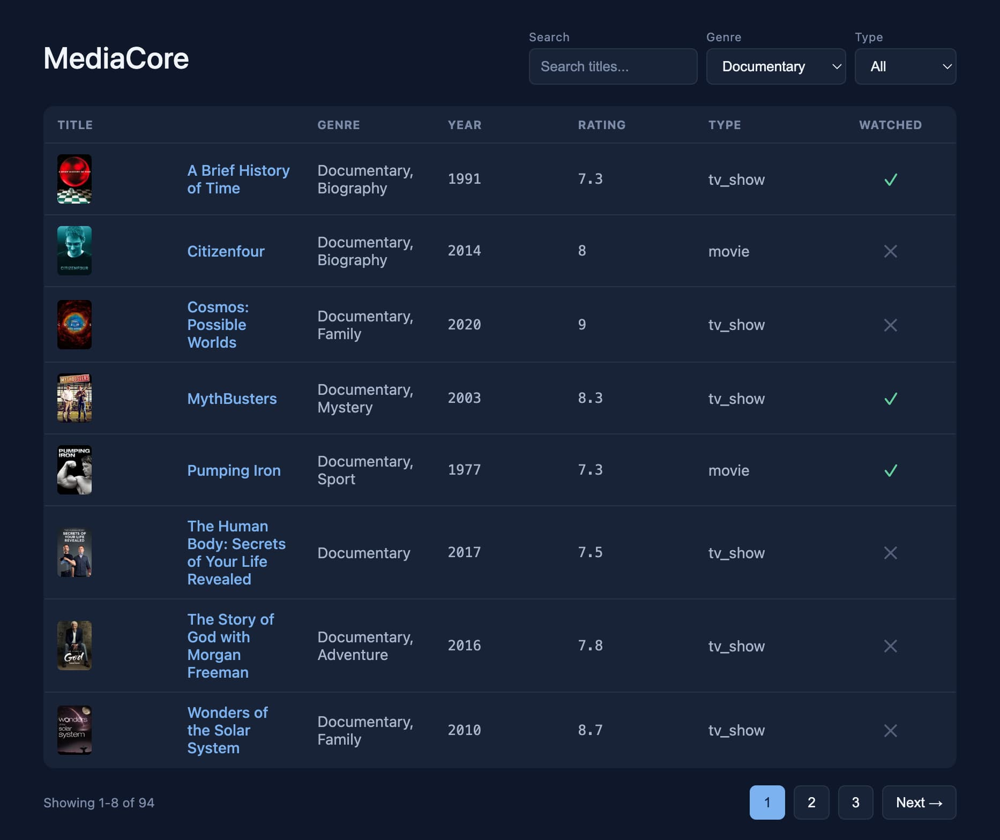

# MediaCore

Full-stack app for browsing a personal media library: a Node/Express/TypeScript API on top of a Python-fed SQLite database, and a React/TypeScript frontend.

**Live demo**: [mediacore.zoltanlederer.com](https://mediacore.zoltanlederer.com)

Part of a three-project series: `MediaCore` → `MediaReco` → `MediaHome`.

## Screenshots

## Stack
- **Backend**: Node.js, Express, TypeScript, better-sqlite3 — deployed on Render
- **Frontend**: React, TypeScript, Vite, React Router — deployed on Porkbun Static Hosting
- Demo dataset: 287 titles from a personal Plex library

## Backend

- `GET /media` — list titles, with optional search, filtering, and pagination
  - `?search=rocky` — search by title (partial match)
  - `?genre=Action` — filter by genre (partial match)
  - `?type=movie` or `?type=tv_show` — filter by media type (exact match)
  - `?page=2&limit=20` — pagination, response includes total count
  - Filters can be combined, e.g. `?search=rocky&genre=Action&type=movie&page=2`
- `GET /genres` — deduplicated, sorted list of all genres in the library
- `GET /media/:index` — fetch a single title by its index
- `PATCH /media/:index/watched` — toggles a title's watched status
- Results sorted alphabetically by title (case-insensitive)

## Frontend

- List view (`/`) — data table with poster thumbnails, clickable titles, a debounced search field, genre/type filter dropdowns, page-number pagination, and an inline watched-status toggle
- Detail view (`/media/:index`) — full info for a single title, fetched independently of the list so it works correctly regardless of active filters/pagination
- Filters, search, and pagination are stored in the URL (not just component state), so the current view is refresh-safe, bookmarkable, and works with browser back/forward
- Shared state (fetched data, filters, handlers) is provided via `useContext`, avoiding prop drilling across components
- Loading states with a spinner, shown especially on cold-start (Render's free tier spins down after inactivity)
- Responsive layout for mobile (stacked header, scrollable table, stacked pagination, stacked detail view)
- Dark theme with a consistent accent color system, custom favicon

## Known Limitations
- Genre filtering supports one genre at a time. Multi-genre search (e.g. Action *or* Comedy) is planned for `MediaHome` project.
- `Sci-Fi` and `Science Fiction` currently appear as separate genre values due to inconsistent labeling from different data sources — planned fix in `MediaHome` project.
- Backend runs on Render's free tier, so the first request after inactivity can take up to a minute (a loading state is shown during this).